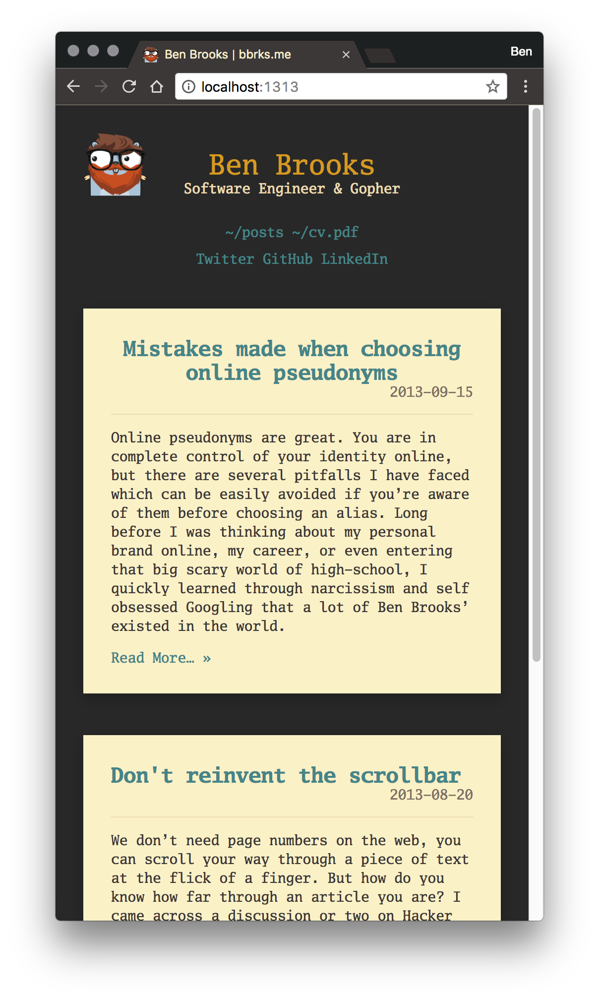
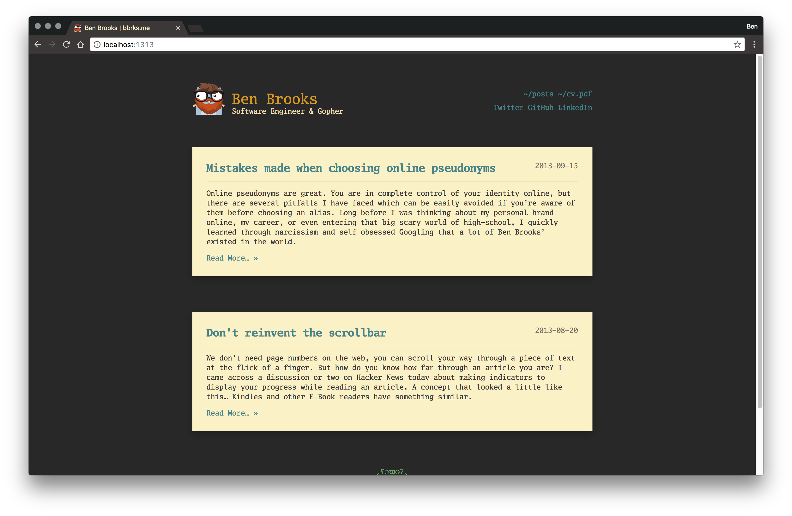

# Hugo Gruvbox theme

A responsive Hugo theme inspired by [gruvbox Retro groove color scheme](https://github.com/morhetz/gruvbox) for Vim.

## Demo

https://bbrks.me



## Installation

If you already have a working Hugo installation, skip to step 3.

1. Install [Hugo](https://gohugo.io/)
2. `hugo new site my\_new\_amazing\_blog.io`
3. `cd my\_new\_amazing\_blog.io/themes/`
4. `git clone git@github.com:bbrks/hugo-gruvbox-theme.git gruvbox`
5. `cd ..`
6. `echo 'theme = "gruvbox"' >> config.toml`
7. `hugo new posts/first-post.md`
8. `hugo server --watch --buildDrafts`

## Configuration

The following parameters can be specified and tweaked in your Hugo config for extra customisation.

```toml
paginate = 5
disqusShortname = ""

[params]
  author = { name = "Ben Brooks" }
  description = "Software Engineer & Gopher"
  keywords = ["software engineering", "golang", "gopher", "blog", "programmer", "bbrks"]
  titlePrefix = ""
  titleSuffix = " | bbrks.me"
  dateFormat = "2006-01-02"
  menuItemPrefix = "~/"
  postTruncateLength = 250
  hideGopher = false
  disqusAutoLoad = false
  disqusAutoLoadCount = false

[[menu.links]]
  name = "CV"
  identifier = "cv.pdf"
  url = "https://rawgit.com/bbrks/cv/master/cv.pdf"
  weight = 9999

[[menu.social]]
  name = "Twitter"
  url = "https://twitter.com/bbrks_"
  weight = 1
[[menu.social]]
  name = "GitHub"
  url = "https://github.com/bbrks"
  weight = 10
[[menu.social]]
  name = "Keybase"
  url = "https://keybase.io/bbrks"
  weight = 30
[[menu.social]]
  name = "LinkedIn"
  url = "https://uk.linkedin.com/in/bbrks"
  weight = 100
```
